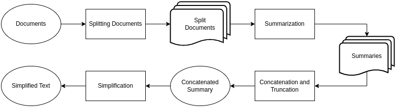
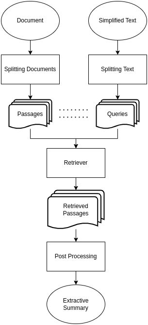
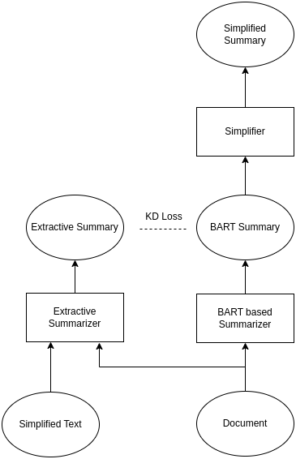
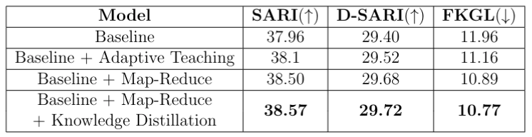

# Legal Document Simplification

## Installation

```
// Create python environment
$ pip install -r requirements.txt
```
**Note:** cuda 12.1 is used. if you do not have it, install cuda library according to your cuda version.

## Dataset
1. Unzip the mildsum.zip in the data folder.
2. Dataset should be present in "data/\<name of dataset\>"
```
data
└─ milsum
   ├── mildsum.test.simple
   ├── mildsum.test.complex
   ├── mildsum.test.summary
   ├── mildsum.valid.simple
   ├── mildsum.valid.complex
   ├── mildsum.valid.summary
   ├── mildsum.train.simple
   ├── mildsum.train.complex
   └── mildsum.train.summary
```

3. Each line contains only data sample
    1. **Complex**: long document
    2. **Simple**: simplified document
    3. **Summary**: summarized document

    **Note:** 
    1. Summary is needed only in the case of knowledge distillation. 
    2. It is created using **ColBERT** (Extractive Summarization)


4. Data size:
    1. **Train**: 2185 samples
    2. **Validation**: 469 samples
    3. **Test**: 468 samples

## Configuration
1. Go to "simsum/bart.py" Line 392 to edit the configuration settings.
2. Turn on "map_reduce" and "distill" flag to enable map reduce and knowledge distillation accordingly.
3. Base Configuration can be found at **simsum/config.json**. 

**Note:** You can not edit configuration from this file. For editing go to "simsum/bart.py" Line 392

## How to run
1. To train the model
```
$ cd simsum/
$ python main.py
```
2. To evaluate the model
```
$ cd simsum/
$ python evaluate.py
```
3. Run the following to get the runtime argument list
```
$ python main.py -h
```
## Methodology
1. Map Reduce



2. Extractive Summarization using ColBERT



3. Knowledge Distillation




## Results


 